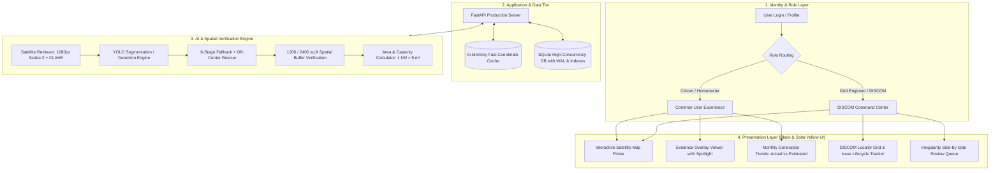

# ☀️ HELIO YAJNA — Solar Verification & Energy Intelligence Platform

> **Complete Product Structure • Role-Based Features • High-Speed System Design**  
> *Official Implementation based on the Revised Product Blueprint*

---

## 🌟 Overview

**Helio Yajna** converts satellite computer-vision rooftop solar detection into a production-grade energy intelligence platform with two unified experiences powered by the same AI verification core:
1. **Citizen / Common User Experience**: "What is installed at my rooftop?" (Solar verification, capacity estimation, monthly generation history, actionable maintenance recommendations, alert feeds).
2. **DISCOM Command Center**: "What is happening across our grid service area?" (Executive area KPIs, locality solar coverage, gross energy generation analytics, installation issue tracking, irregularity review center with side-by-side evidence).

---

## 🏗️ 4-Layer Master System Architecture



---

## 🎨 UI Design System: Solar Gold & Deep OLED Black

- **Primary Colors**: Solar Sun Yellow (`#F59E0B`, `#FACC15`, `#FBBF24`) + Deep Obsidian Black (`#07080B`, `#0D0E15`).
- **Glassmorphism**: Translucent panels with amber atmospheric glow (`backdrop-blur-xl bg-[#0D0E15]/80`).
- **Interactive Map**: Google Maps Hybrid Satellite canvas with pinpoint targeting, address autocomplete, and preset solar hotspots.
- **Visual Evidence**: Spotlight visualization darkening non-buffer pixels, semi-transparent green panels inside buffer, red outside.

---

## ⚡ System Design Highlights for Low-Latency Access

1. **In-Memory LRU Cache Tier**:
   - Geographically hashed coordinate cache in `backend/services.py` serves repeat map queries in **<10ms**.
2. **SQLite WAL Mode & Compound Indexing**:
   - High-concurrency reads/writes with `PRAGMA journal_mode = WAL`, 64MB cache, and compound indices on `(lat, lon)`, `locality`, and `status`.
3. **High-Fidelity Satellite Processing**:
   - Google Static Maps called with `scale=2` (1280×1280 effective pixels) + CLAHE luminance equalization to guarantee small rooftop panels are never blurred.
4. **Single Source of Truth**:
   - When a citizen scans a property, it is stored in the database once and immediately aggregates into DISCOM locality metrics.

---

## 🚀 How to Run the Production System

### Prerequisites
- Python 3.10+
- Node.js 18+

### Step 1 — Start the Backend Server (FastAPI)
```powershell
# Navigate to project root
cd c:\Users\rohit\OneDrive\Desktop\Helio

# Start the API server
python -m backend.main
```
> API runs at: **http://localhost:8000**  
> Interactive OpenAPI Docs: **http://localhost:8000/docs**

### Step 2 — Start the Frontend (React + Vite)
Open a new terminal:
```powershell
cd c:\Users\rohit\OneDrive\Desktop\Helio\frontend

# Install dependencies (first time only)
npm install

# Start development server
npm run dev
```
> Web UI opens at: **http://localhost:5173/Helio/**

---

## 📋 Evaluation Checklist & Demo Guide

| Flow | What to Demonstrate |
|---|---|
| **1. Citizen Scan** | Select "Citizen / Common User" role. Click any point on the map or choose *IIT Madras Solar Rooftop*. Click **Run AI Solar Detection**. Observe 6-stage pipeline execution, verified spotlight overlay, detected $m^2$, and capacity in $kW$. |
| **2. Energy Trend** | View the monthly generation bar chart comparing **Actual (Smart Meter)** vs **Modeled Estimate** with explicit transparency labeling. |
| **3. Recommendations** | Review evidence-based maintenance prompts (e.g. *Seasonal Dust & Soiling Clearance* +12.5% yield). Click "Done" to complete. |
| **4. Role Switch** | Click **DISCOM Command Center** in the top navigation bar. |
| **5. Locality Analytics** | View Locality A, B, C, D aggregated metrics (18,420 Analyzed, 12,870 Solar Sites, 42.6 MW Capacity, 42.5 GWh Gross Energy). |
| **6. Installation Issues** | Open the *Installation Issues* tab. View the structured lifecycle: `Open` → `Assigned` → `In Progress` → `Evidence Added` → `Resolved` → `Closed`. Advance an issue status with one click. |
| **7. Review Center** | Open *Irregularity / Review Center*. Inspect side-by-side evidence for an unregistered 8.4 kW solar site. Enter reviewer notes and click **Approve & Regularize** or **Flag for Inspection**. |
| **8. Audit Export** | Click **Export CSV** in the navbar to immediately download the verified sites ledger. |